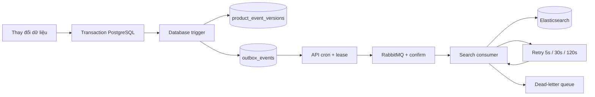

# Outbox pattern: đồng bộ sản phẩm sang tìm kiếm

Luồng hiện tại: **transaction PostgreSQL → outbox → RabbitMQ → Search Service → Elasticsearch**. Database trigger ghi snapshot trong chính transaction thay đổi dữ liệu. API cron phát message và chỉ đánh dấu `PROCESSED` sau publisher confirm. Search consumer kiểm tra version để bỏ qua sự kiện trùng hoặc cũ.

Phạm vi là đồng bộ sản phẩm sang search. Đây chưa phải luồng sự kiện đơn hàng, thanh toán hoặc reservation tồn kho.

## Các thành phần

| Thành phần | Vai trò |
| --- | --- |
| [Migration SQL](../packages/e-commerce-db/changelog/outbox-sql/outbox-reliability.sql) | Trigger, snapshot, version ledger và index |
| [Prisma schema](../packages/e-commerce-api/prisma/schema.prisma) | Metadata retry, lease, processing |
| [OutboxProcessorService](../packages/e-commerce-api/src/api/v1/product/outbox/outbox-processor.service.ts) | Claim sự kiện, publish, retry, dọn lịch sử |
| [RabbitMQService](../packages/e-commerce-api/src/common/services/rabbitmq.service.ts) | Confirm channel, mandatory routing, reconnect |
| [Search consumer](../packages/e-commerce-search/src/rabbitmq.ts) | ACK, retry queues, DLQ, reconnect |
| [Search handler](../packages/e-commerce-search/src/handlers/product.ts) | Validation, embedding, version, tombstone |
| [Recovery script](../scripts/sync-elasticsearch.js) | Tạo lại snapshot qua outbox |



## Ghi sự kiện và contract

Trigger hoạt động trên:

- `products`: INSERT, UPDATE, DELETE.
- `product_variants`, `product_images`: INSERT, UPDATE, DELETE; chuyển quan hệ sang sản phẩm khác tạo snapshot cho cả hai sản phẩm.
- `categories`, `brands`: đổi tên tạo snapshot cho các sản phẩm liên quan.

`ProductsRepository` vẫn dùng transaction cho các thao tác nghiệp vụ nhưng không tự INSERT outbox nữa. Không thêm lệnh publish trực tiếp sau transaction. Các repository khác và các lệnh SQL cũng đi qua trigger khi thay đổi các bảng trên. Thay đổi tồn kho trong `warehouse_inventory` chưa tạo sự kiện vì search hiện không có trường tồn kho; cần mở rộng contract nếu search dùng dữ liệu này.

Snapshot gồm sản phẩm, danh mục, thương hiệu, ảnh và biến thể. Giá tìm kiếm là giá dương nhỏ nhất trong các biến thể, hoặc `0` khi không có giá phù hợp.

`product_event_versions` tăng version trong cùng transaction bằng UPSERT có khóa theo sản phẩm. Ledger được giữ khi xóa sản phẩm hoặc dọn outbox. Version bắt đầu ở `1000000000000`, cao hơn version nội bộ thông thường của index cũ. Version được serialize thành số nguyên an toàn JavaScript.

```json
{
  "eventId": "uuid-sự-kiện",
  "aggregateType": "product",
  "aggregateId": "uuid-sản-phẩm",
  "eventType": "updated",
  "eventVersion": 1000000000001,
  "schemaVersion": 1,
  "payload": {
    "id": "uuid-sản-phẩm",
    "name": "Áo polo",
    "is_published": true,
    "product_variants": [{ "price": 150000 }],
    "categories": { "name": "Áo" },
    "brands": { "name": "Thương hiệu" },
    "product_images": []
  },
  "timestamp": "2026-10-08T08:00:00.000Z"
}
```

Sự kiện xóa có `eventType = deleted`, payload `{ productId }`. Consumer từ chối envelope/payload không hợp lệ hoặc `schemaVersion` chưa hỗ trợ và đưa vào DLQ.

## Publisher và nhiều API instance

Cron chạy mỗi 5 giây, xử lý tối đa 50 sự kiện mỗi lượt. Mỗi sự kiện được claim riêng bằng một câu SQL `FOR UPDATE SKIP LOCKED`, chuyển sang `PROCESSING`, tăng `attempts`, đặt UUID `lock_token` và lease 30 giây. Worker dừng thì worker khác có thể claim lại khi lease hết hạn. UPDATE kết quả luôn kiểm tra token để worker cũ không ghi đè trạng thái của worker mới.

Publisher khai báo exchange `product_events`, queue durable `search_product_sync_queue` và binding `product.#` trước khi phát; Search Service không cần chạy trước API để queue tồn tại. Message dùng `persistent`, `mandatory` và confirm channel. Message bị return, NACK, timeout confirm 10 giây hoặc mất connection đều không được đánh dấu hoàn tất. Giá trị `false` từ `publish()` là backpressure; processor chờ confirm trước message tiếp theo.

Lỗi publish đưa sự kiện về `PENDING`, lưu `last_error`, retry sau 5 giây rồi tăng gấp đôi, tối đa 5 phút. Publisher retry không giới hạn để sự cố broker kéo dài không tự loại sự kiện. Cron bảo trì mỗi giờ log số lượng/thời điểm sự kiện chờ cũ nhất và dọn tối đa 1000 bản ghi `PROCESSED` quá 30 ngày.

`PROCESSED` nghĩa là broker đã confirm message được định tuyến, chưa phải Elasticsearch đã cập nhật. Publisher confirm và consumer ACK là hai cơ chế riêng biệt. Xem [RabbitMQ confirms](https://www.rabbitmq.com/docs/confirms).

## Search consumer, retry và DLQ

Consumer cấu hình `prefetch(1)` cho từng queue và tự reconnect khi connection/channel bị đóng. Chỉ ACK sau khi cập nhật Elasticsearch thành công hoặc sau khi message thay thế đã được broker confirm.

| Queue | Nội dung |
| --- | --- |
| `search_product_sync_queue` | Message ban đầu |
| `search_product_sync_queue.retry.5000` | Retry sau ít nhất 5 giây |
| `search_product_sync_queue.retry.30000` | Retry sau ít nhất 30 giây |
| `search_product_sync_queue.retry.120000` | Retry sau ít nhất 120 giây |
| `search_product_sync_queue.dead` | JSON/contract sai hoặc đã hết 3 lượt retry |

Retry queues durable lưu `x-not-before`. Consumer giữ delivery chưa ACK trong thời gian chờ bằng timer bất đồng bộ; restart sẽ giao lại và giữ thời điểm retry. Cách này không cần plugin delayed exchange hoặc TTL/DLX. Mỗi retry queue có một delivery đang xử lý trên mỗi consumer instance; backlog có thể làm thời gian retry dài hơn các mức trên.

Header retry/DLQ giữ `x-retry-count`, `x-last-error`, `x-failed-at`. Nếu publish sang retry/DLQ thất bại, consumer đóng channel và giữ original chưa ACK để broker giao lại. Nếu crash sau confirm trước ACK, có thể có message trùng.

Elasticsearch dùng `version_type = external`. Handler đọc `_version` trước để bỏ qua sự kiện cũ/trùng mà không tạo embedding lại; external versioning vẫn chặn race giữa các consumer. Chỉ lỗi `version_conflict_engine_exception` được coi là đã bị sự kiện mới hơn thay thế. Xem [Elasticsearch Index API](https://www.elastic.co/guide/en/elasticsearch/reference/8.19/docs-index_.html).

Xóa hoặc bỏ xuất bản ghi một document tối thiểu `deleted: true`, vẫn giữ version. Cả lexical search và KNN đều loại document này. Tombstone được giữ lâu dài để snapshot cũ không làm sản phẩm xuất hiện trở lại. `eventId` được lưu vào document để truy vết; version là cơ chế chống ghi lại và đảo thứ tự.

## Chạy `sync-elasticsearch.js`

```bash
pnpm run sync:es
```

Script đọc cấu hình PostgreSQL từ `.env` ở root; dùng TLS có kiểm tra chứng chỉ, hoặc `PGSSLMODE=disable` cho database local không dùng TLS.

1. Lấy hợp nhất ID từ `products` và `product_event_versions`.
2. Gọi `enqueue_product_event(id)` cho từng ID, mỗi ID một transaction.
3. Hàm database tăng version và ghi snapshot hiện tại vào outbox. Nếu sản phẩm đã xóa, ghi tombstone.
4. API cron phát RabbitMQ; Search Service cập nhật Elasticsearch theo luồng thường.

Script kết thúc khi đã enqueue, không chờ embedding/index/refresh hoàn tất. API và Search Service phải chạy để drain backlog. Script không cần API key embedding hoặc credentials Elasticsearch. Có thể chạy lại nếu script bị ngắt; ID đã enqueue sẽ có version cao hơn ở lần chạy tiếp theo.

Sản phẩm chưa xuất bản sẽ bị ẩn. Sản phẩm đã xóa có ID trong ledger sẽ được đồng bộ dấu xóa. Document Elasticsearch mồ côi mà ID không có trong database/ledger/lịch sử outbox cần đối soát riêng; script không biết các ID này.

## Migration và triển khai

Migration mới là `zz_outbox_reliability.changelog.yaml`, được master changelog include tự động. SQL nằm trong thư mục changelog để image migration hiện tại đóng gói đầy đủ. Không sửa checksum migration tạo outbox cũ.

Triển khai phối hợp: dừng writer API, script ghi dữ liệu và Search consumer cũ; chạy Liquibase; generate Prisma client/build API và Search bản mới; khởi động lại. Không chạy song song consumer cũ với consumer có version: consumer cũ có thể ghi document không kiểm tra version.

Migration chuyển outbox `PENDING` cũ sang `SUPERSEDED`, giữ chúng để kiểm tra, rồi enqueue snapshot hiện tại của sản phẩm và dấu xóa từ lịch sử outbox. Các message legacy còn trong RabbitMQ không có version sẽ vào DLQ; snapshot bootstrap mới sẽ đưa index về dữ liệu hiện tại. Bootstrap có thể tạo backlog lớn trên database có nhiều sản phẩm, cần bố trí thời gian migration phù hợp.

## Quan sát và phục hồi

```sql
SELECT status, count(*) FROM outbox_events GROUP BY status;
SELECT id, aggregate_id, attempts, last_error, next_attempt_at, locked_until,
       CURRENT_TIMESTAMP - created_at AS age
FROM outbox_events WHERE status IN ('PENDING', 'PROCESSING')
ORDER BY created_at LIMIT 50;
SELECT event_version, event_type, status, created_at, processed_at
FROM outbox_events WHERE aggregate_id = 'UUID_SẢN_PHẨM'
ORDER BY event_version DESC;
```

Theo dõi backlog log `OutboxProcessorService`, tuổi sự kiện, số message ready/unacked ở main/retry queues và số message DLQ trong RabbitMQ Management. Đây là số liệu SQL/log, chưa có endpoint Prometheus riêng.

Sau khi sửa lỗi embedding/Elasticsearch, có thể dùng `pnpm run sync:es` để tạo snapshot mới. Để phát lại một message cụ thể trong DLQ, dùng RabbitMQ Management lấy/re-publish nguyên envelope sang main queue, reset `x-retry-count` và `x-not-before`; chỉ ACK/xóa bản DLQ khi publish lại thành công. Không tự bật consumer DLQ vì contract sai có thể tạo vòng lặp vô hạn.

## Bảo đảm và giới hạn

- Ghi nghiệp vụ, version và sự kiện nguyên tử trong PostgreSQL; không phụ thuộc broker lúc request ghi database.
- Có thể phát/giao message nhiều lần; version bảo đảm snapshot cũ/trùng không ghi đè dữ liệu mới.
- Publish confirm phụ thuộc độ bền của broker/queue được vận hành. Queue hiện giữ cấu hình durable tương thích queue cũ; muốn replication cần migration queue sang quorum có kế hoạch.
- Hết retry sẽ giữ message ở DLQ, cần quan sát và phục hồi; không cam kết mọi lỗi tự khắc phục.
- Thời gian đồng bộ gồm cron, backlog, retry, embedding, indexing và refresh. ACK chưa đồng nghĩa kết quả lập tức hiện qua search.
- Không xóa ledger/tombstone tùy ý; sẽ mất bảo vệ trước message cũ. Transaction thay đổi nhiều aggregate có thể gặp deadlock PostgreSQL và phải được caller thử lại.

## Kiểm thử

```bash
pnpm --filter e-commerce-api exec jest --runInBand outbox-processor.service.spec.ts rabbitmq.service.spec.ts
pnpm --filter e-commerce-search test
psql "$TEST_DATABASE_URL" -f packages/e-commerce-db/test/outbox.sql
```

SQL test cần database tạm đã chạy Liquibase; kiểm tra trigger sản phẩm/biến thể/ảnh/danh mục/thương hiệu, rollback, dấu xóa, version sau tạo lại và thu hồi lease. Mọi dữ liệu test được rollback. Unit tests kiểm tra confirm/return/NACK, backpressure, ownership, retry/DLQ, duplicate/stale events, tombstone và bộ lọc search. Không gọi dịch vụ embedding bên ngoài trong unit tests.
